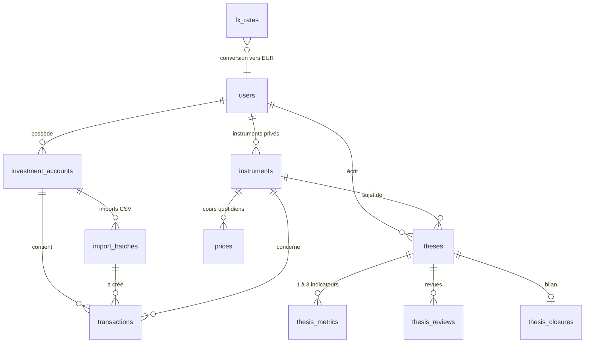

# 2. Modèle de données

Code : [`src/db/schema.ts`](../src/db/schema.ts) · Migration : [`drizzle/`](../drizzle) ·
Tests : [`tests/schema.test.ts`](../tests/schema.test.ts)

## Choix techniques

| Sujet | Choix | Pourquoi |
|-------|-------|----------|
| Application | Next.js + TypeScript (un seul langage) | Front et API dans le même projet, calculs typés de bout en bout. |
| Base | PostgreSQL 16 | Contraintes fortes, `numeric` exact, hébergeable en UE. |
| Accès base | Drizzle ORM | Schéma en TypeScript, SQL lisible, migrations versionnées. |
| Nombres | `numeric` en base, `decimal.js` en calcul | Aucun arrondi flottant : exigence d'exactitude à 0,1 %. |

## Schéma

## Décisions métier prises (à valider)

Tu m'as laissé trancher ; voici ce que j'ai retenu. Chaque point se modifie facilement maintenant,
beaucoup moins une fois des données saisies.

### 1. Multi-devises, consolidation en euros
- Chaque transaction est stockée **dans sa devise d'origine** (un achat de Microsoft reste en USD).
- On conserve le **taux réellement appliqué par le courtier** (`fx_rate_to_eur`) quand il est connu ;
  sinon on utilise le **taux de référence BCE** du jour (table `fx_rates`, source officielle et gratuite).
- Convention unique : `1 EUR = rate × devise`, donc `montant_eur = montant / rate`.
- Conséquence : la plus-value en euros d'un titre en dollars intègre l'effet de change ;
  on pourra afficher séparément « effet titre » et « effet devise ».

### 2. Fonds euros (assurance-vie, PER)
- Instrument de type `fonds_euros` en **valorisation nominale** : 1 part = 1 €.
- Un versement de 5 000 € = achat de 5 000 parts à 1 €.
  Les intérêts crédités (souvent une fois par an) = opération `interets` qui ajoute des parts.
- Pas de cours quotidien à récupérer ; la valeur est toujours exacte et vérifiable sur le relevé annuel.
- Chaque fonds euros est un instrument **privé** de l'utilisateur (pas d'ISIN).

### 3. Prix de revient : PRU moyen pondéré, frais inclus
- Méthode du **prix moyen pondéré d'acquisition** : c'est la règle fiscale française pour les titres
  d'un CTO, et celle qu'affichent les courtiers français.
- Les **frais d'achat sont inclus** dans le prix de revient (comme le fait l'administration fiscale).
- Le PRU est calculé **par compte** (un même titre dans un PEA et un CTO a deux PRU distincts),
  et en euros au taux de change de chaque achat.
- Une vente ne modifie pas le PRU des titres restants.

### 4. Autres choix
- `investment_accounts` (et non `accounts`) pour ne pas entrer en conflit avec la table d'Auth.js.
- Types d'opérations : achat, vente, dividende, intérêts, frais, taxe, versement, retrait.
  Les retenues à la source sur dividendes vont dans `taxes`.
- `provider_refs` sur l'instrument : les codes de chaque fournisseur de données, pour en changer
  sans migration.
- `region` : zone géographique déclarée (ex. « monde » pour un ETF MSCI World). L'exposition
  réelle titre par titre viendra avec la transparisation en V2 (nouvelle table, sans casser celle-ci).
- Chaque cours (`prices.source`) et chaque valeur d'indicateur (`current_value_source`) a une source.
- Aucune donnée intraday : un seul cours de clôture par jour et par instrument.
- `import_batches` garde le mapping de colonnes d'un import CSV (réutilisable, et annulable en bloc) ;
  `external_ref` empêche d'importer deux fois la même ligne.

## Garanties vérifiées par les tests
- Achat/vente : instrument, quantité > 0 et prix obligatoires. Versement/retrait : pas d'instrument.
- Frais et taxes jamais négatifs ; ISIN au bon format ; conviction entre 1 et 5.
- Précision conservée (10 décimales sur les quantités et les taux de change).
- Une seule clôture par thèse.
- **Suppression complète d'un utilisateur** (`deleteUserData`) : comptes, transactions, thèses,
  instruments privés effacés ; instruments partagés conservés.

## Points ouverts (pour plus tard)
- **Divisions d'actions** (splits) et opérations sur titres : non gérées en V1.
- **Chiffrement** des textes de thèse : à faire au niveau applicatif lors de l'étape « journal de thèse ».
- La limite « 1 à 3 indicateurs par thèse » est appliquée par l'application, pas par la base.
